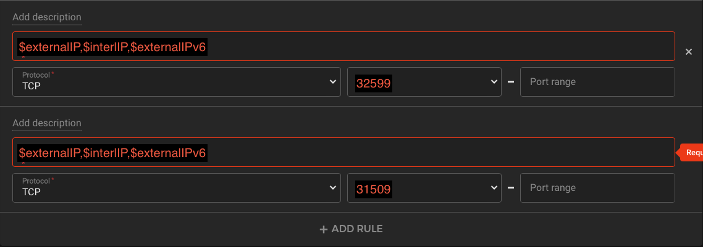
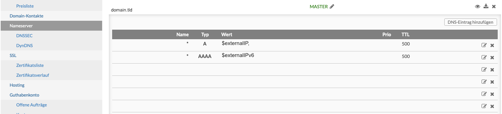

# First Tools for your Kubernetes Cluster on Hetzner
In my last blog post, I wrote about how to deploy a Kubernetes cluster on the Hetzner Cloud. Today I will talk about which tools could be useful for us to deploy applications as well. For this we will need Kubectl, Kubeconfig and HELM3 on our local computer. 

Everything described here is based on the [article] (https://0hlov3.medium.com/install-a-kubernetes-cluster-on-hetzner-cloud-200d4fb6a423)

## Kubectl
> The kubectl command line tool lets you control Kubernetes clusters. For configuration, kubectl looks for a file named config in the $HOME/.kube directory. You can specify other  [kubeconfig](https://kubernetes.io/docs/concepts/configuration/organize-cluster-access-kubeconfig/)  files by setting the KUBECONFIG environment variable or by setting the  [—kubeconfig](https://kubernetes.io/docs/concepts/configuration/organize-cluster-access-kubeconfig/)  flag.  

Since we need the Kubectl to manage our Kubernetes-Cluster, we have to install it on our computer as described in the documentation.

* [Install and Set Up kubectl on Linux | Kubernetes](https://kubernetes.io/docs/tasks/tools/install-kubectl-linux/)
* [Install and Set Up kubectl on macOS | Kubernetes](https://kubernetes.io/docs/tasks/tools/install-kubectl-macos/)
* [Install and Set Up kubectl on Windows | Kubernetes](https://kubernetes.io/docs/tasks/tools/install-kubectl-windows/)

### Get the Kubeconfig

After we installed kubectl we need the Kubeconfig, we take here the example from my [other article] (https://0hlov3.medium.com/install-a-kubernetes-cluster-on-hetzner-cloud-200d4fb6a423).

```shell
scp testuser@controller01:/home/testuser/.kubeconfig/config $HOME/.kube/hetzner-cloud
```

After we got the kubeconfig we can export the path of the kubeconfig as environment variable, so that Kubectl will use our config, if you don’t have another kubeconfig before, you can also use the default path `$home/.kube/config`.

```shell
export KUBECONFIG=$HOME/.kube/hetzner-cloud
```

After we have exported the environment variable, we can briefly check if it works.

```shell
kubectl get nodes
```

The above command should show us something like
```shell
NAME           STATUS   ROLES                  AGE   VERSION
controller01   Ready    control-plane,master   8d    v1.22.5
node01         Ready    node,worker            8d    v1.22.5
```

## HELM3
Now that we have access to our Kubernetes cluster from our local working machine, we still need HELM3 for the next steps.

> The package manager for Kubernetes  
> Helm is the best way to find, share, and use software built for  [Kubernetes](https://kubernetes.io/) .  

I also recommend reading the Helm documentation on how to [Install Helm](https://helm.sh/docs/intro/install/) on your operating system.

Helm is a wonderful tool with which you can deploy packages in your Kubernetes cluster. You can build your own Helm packages or you can use the packages of the software vendors.

## Ingress-Nginx
[ingress-nginx](https://kubernetes.github.io/ingress-nginx/) is an ingress controller for Kubernetes that uses NGINX as a reverse proxy and load balancer. if we deploy this to our Hetzner Cloud, we get a LoadBalancer from HetznerCloud. If we don't give a special annotation, our ingress-nginx gets an external IP address, after that we can use the ingress-nginx to make our application public.

First, we create an ingress-values.yaml with the following parameters. 

```yaml
controller:
  replicaCount: 1
  service:
    enabled: true
    type: LoadBalancer
    annotations:
      load-balancer.hetzner.cloud/location: nbg1
  resources:
    limits:
      cpu: "250m"
      memory: "250Mi"
    requests:
      cpu: "100m"
      memory: "100Mi"
  ingressClassResource:
    name: nginx
    enabled: true
    default: true
    controllerValue: "k8s.io/ingress-nginx"
  ingressClassByName: true
```

I did a little research on the [parameters](https://github.com/0hlov3/kubernetes-on-hetzner/blob/main/ingress-nginx/README.md).

Now we can add the Helm Repository to our local helm installation.

```shell
# Adds the Helm Repository
helm repo add ingress-nginx https://kubernetes.github.io/ingress-nginx
# Updates the Cached repositories
helm repo update
```

Now that we have added the Helm repository, we can deploy the ingress-controller to our cluster.

```shell
helm upgrade --install ingress-nginx ingress-nginx/ingress-nginx -f ingress-values.yaml --namespace ingress-nginx --create-namespace
```

We will use `upgrade -install` so that an existing installation will also be updated with new parameters.  `ingress-nginx` is the Name of our installation. `ingress-nginx/ingress-nginx` Is the name of the repository.  `-f ingress-values.yaml` are the values we apply to the HelmChart deployment. `--namespace ingress-nginx` is the namespace where we deploy the HelmChart into.  `--create-namespace` creates the NameSpace if it does not exist.

### Update the Firewall
After we have deployed our Nginx controller, we need to check once if we got a load balancer.

```shell
kubectl get svc -n ingress-nginx
```

We should see the following In the output .
```
NAME                                 TYPE           CLUSTER-IP      EXTERNAL-IP                                      PORT(S)                      AGE
ingress-nginx-controller             LoadBalancer   $ClusterIP   $externalIP,$interlIP,$externalIPv6   80:32599/TCP,443:31509/TCP   8d
ingress-nginx-controller-admission   ClusterIP      10.98.249.185   <none>                                           443/TCP                      8d
```

or we simply look in the Hetzner Cloud Webfrontend for the LoadBalancer.

As we can see we have received the following information. External IPs $externalIP,$interlIP,$externalIPv6 and ports 80:32599/TCP,443:31509. With this information we update our previously created firewall.

Add two new “Firewall Rules”  to  the Firewall.



### Set the A-Record
Now that we have deployed the ingress-nginx and obtained a load balancer through the hcloud-cloud-controller-manager, we can point our domain to the load balancer's IPs.

So you can go to the Domain Registrar of your Choice, and set the A-Record to the $externalIP and the AAA-Record to the $externalIPv6.

Since I work with INWX, I can only show an example from the INWX frontend, here I created a wildcard entry, which points to my loadbalancer IP per IPv4 and IPv6.




## cert-manager
> cert-manager adds certificates and certificate issuers as resource types in Kubernetes clusters, and simplifies the process of obtaining, renewing and using those certificates.  
> It can issue certificates from a variety of supported sources, including  [Let’s Encrypt](https://letsencrypt.org/) ,  [HashiCorp Vault](https://www.vaultproject.io/) , and  [Venafi](https://www.venafi.com/)  as well as private PKI.  
> It will ensure certificates are valid and up to date, and attempt to renew certificates at a configured time before expiry.  
> It is loosely based upon the work of  [kube-lego](https://github.com/jetstack/kube-lego)  and has borrowed some wisdom from other similar projects such as  [kube-cert-manager](https://github.com/PalmStoneGames/kube-cert-manager) .  

We will configure the cert-manager here to obtain certificates via [HTTP-Challange](https://cert-manager.io/docs/configuration/acme/http01/). The cert-manager also supports a [DNS-Challange](https://cert-manager.io/docs/configuration/acme/dns01/#configuring-dns01-challenge-provider), this is needed when working with internal IPs in the FQDNs or when our cluster is not directly reachable from the internet. 

For the HTTP-Challange it is important that the firewall also allows port 80. Because the container and the ingress which provide the 'auth code' listen on port 80.

Since we are doing a HELM deployment here again, we first create a helm-values.yaml.

```yaml
installCRDs: true
ingressShim:
  defaultIssuerName: letsencrypt-prod
  defaultIssuerKind: ClusterIssuer
prometheus:
  enabled: false
  servicemonitor:
    enabled: false
resources:
  requests:
    cpu: 10m
    memory: 32Mi
  limits:
    cpu: 100m
    memory: 100Mi
```

After we have created our helm-values.yaml, we need to add the HELM repository again.

```shell
helm repo add jetstack https://charts.jetstack.io
helm repo update
```

after we have successfully added the repo, we can deploy the cert manager.

```shell
helm upgrade --install cert-manager jetstack/cert-manager --namespace cert-manager --create-namespace -f values.yaml
```

because i have already explained above (in the ingress-nginx section) what this command does, i will not explain it again here. But feel free to leave me a message if I can explain something better.

### Create a ClusterIssuer

> Issuers, and ClusterIssuers, are Kubernetes resources that represent certificate authorities (CAs) that are able to generate signed certificates by honoring certificate signing requests. All cert-manager certificates require a referenced issuer that is in a ready condition to attempt to honor the request.  

In our case, we will deploy a ClusterIssuer here, since it can be used from the whole cluster. For this we create a clusterissuer.yaml with the example below, we have to replace the email 'your@email.tld' with the email that should be notified about expiring certificates and changes to LetsEncrypt. However, the cert-manager will normally still take care of updating the certificates in time without us having to do anything.

```yaml
apiVersion: cert-manager.io/v1
kind: ClusterIssuer
metadata:
  name: letsencrypt-prod
  namespace: cert-manager
spec:
  acme:
    # You must replace this email address with your own.
    # Let's Encrypt will use this to contact you about expiring
    # certificates, and issues related to your account.
    email: your@email.tld
    server: https://acme-v02.api.letsencrypt.org/directory
    privateKeySecretRef:
      # Secret resource that will be used to store the account's private key.
      name: letsencrypt-prod
    # Add a single challenge solver, HTTP01 using nginx
    solvers:
    - http01:
        ingress:
          class: nginx
```

## Lets test if everything is working
Now that we have deployed the ingress-controller, the cert-manager and our A-record, we can test if everything works as expected.

for this we will create a namespace, deploy an nginx container, a service and an ingress. So wie are going to create a test-deployment.yaml and copy the Data we need into this file.  We habe to change `your.domain.tld` to our Domain we create the A-Record for. You can check this simply with the command `host your.domain.tld` if  you get the configured IPs of your LoadBalancer, the A-Record works as aspected.

```yaml
---
apiVersion: v1
kind: Namespace
metadata:
  name: nginx-test
---
apiVersion: apps/v1
kind: Deployment
metadata:
  labels:
    app: nginx
  name: nginx
  namespace: nginx-test
spec:
  replicas: 1
  selector:
    matchLabels:
      app: nginx
  template:
    metadata:
      labels:
        app: nginx
    spec:
      containers:
      - image: nginx
        name: nginx
        ports:
        - containerPort: 80
---
apiVersion: v1
kind: Service
metadata:
  name: nginx
  namespace: nginx-test
  labels:
    app: nginx
spec:
  ports:
  - port: 80
    protocol: TCP
    targetPort: 80
  selector:
    app: nginx
---
apiVersion: networking.k8s.io/v1
kind: Ingress
metadata:
  name: nginx
  namespace: nginx-test
  annotations:
    nginx.ingress.kubernetes.io/rewrite-target: /
    cert-manager.io/cluster-issuer: "letsencrypt-prod"
    kubernetes.io/tls-acme: "true"
spec:
  ingressClassName: nginx
  rules:
  - host: your.domain.tld
    http:
      paths:
      - path: /
        pathType: Prefix
        backend:
          service:
            name: nginx
            port:
              number: 80
  tls:
    - hosts:
      - your.domain.tld
      secretName: tls-nginx-general
...
```

##  Helpful Links
* [Generating a new SSH key and adding it to the ssh-agent - GitHub Docs](https://docs.github.com/en/authentication/connecting-to-github-with-ssh/generating-a-new-ssh-key-and-adding-it-to-the-ssh-agent)]
* [GitHub - flannel-io/flannel: flannel is a network fabric for containers, designed for Kubernetes](https://github.com/flannel-io/flannel#flannel)
* [GitHub - hetznercloud/hcloud-cloud-controller-manager: Kubernetes cloud-controller-manager for Hetzner Cloud](https://github.com/hetznercloud/hcloud-cloud-controller-manager)
* [GitHub - hetznercloud/csi-driver: Kubernetes Container Storage Interface driver for Hetzner Cloud Volumes](https://github.com/hetznercloud/csi-driver)
* [Welcome - NGINX Ingress Controller](https://kubernetes.github.io/ingress-nginx/)
* [cert-manager](https://cert-manager.io)
* [external-dns/hetzner.md at master · kubernetes-sigs/external-dns · GitHub](https://github.com/kubernetes-sigs/external-dns/blob/master/docs/tutorials/hetzner.md)
*
## Don‘t trust me
The author does not assume liability for errors contained in or for damages arising from the use of the Information.

And do not hesitate to ask me questions or send me suggestions for improvement.

#hetzner #hetzner/Hetzner-Cloud #Kubernetes