# Install a Kubernetes-Cluster on Hetzner Cloud
[Medium Article](https://faun.pub/install-a-kubernetes-cluster-on-hetzner-cloud-200d4fb6a423)

Hetzner is in my opinion a very good hoster, where you can get everything from a high-performance web hosting, managed servers, cloud servers, dedicated root servers and colocation services from one Hand, they are also working hard to improve the products and they are currently ahead in terms of price-performance ratio.

Since Hetzner has not been in the cloud business as long as other competitors, there are no managed databases or 1-click Kubernetes clusters yet, but the cloud tools and CLI tools work pretty well.

## Install a Kubernetes-Cluster on Hetzner Cloud
> [Kubernetes](https://kubernetes.io/docs/concepts/overview/what-is-kubernetes/) , also known as K8s, is an open-source system for automating deployment, scaling, and management of containerized applications.  


### Create Project
If we want to deploy virtual machines on the Hetzner Cloud, we need a Hetzner account first. After we got an Account, we need to create a project within the  [Hetzner Cloud](https://console.hetzner.cloud/) . The resources are always attached to a project.

Once we have logged into the  [Hetzner Cloud](https://console.hetzner.cloud/) , we need to create a project by clicking on “+ NEW PROJECT” and then assigning a name to our project.

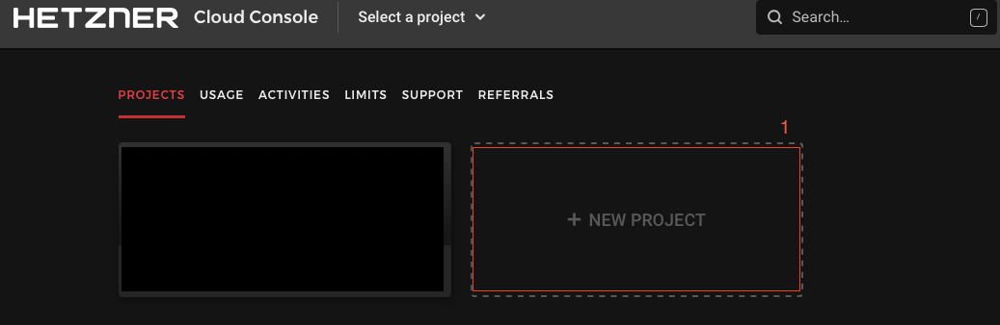
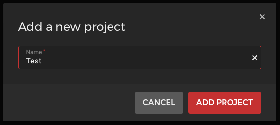

### Create two or  more Nodes
After we have created the project, we come to the "Servers" overview, since we currently have no servers, there is only the button "Add Server" which we now click to create our nodes.

We will create a 2 node cluster here for development purposes, if we want to run a production Kubernetes cluster we should create 3 controllers and 3 nodes.

Once we have clicked on "ADD SERVER", we choose our location (e.g. Nuremberg) our OS image (e.g. Ubuntu 20.04) our type (e.g. standard CX21).

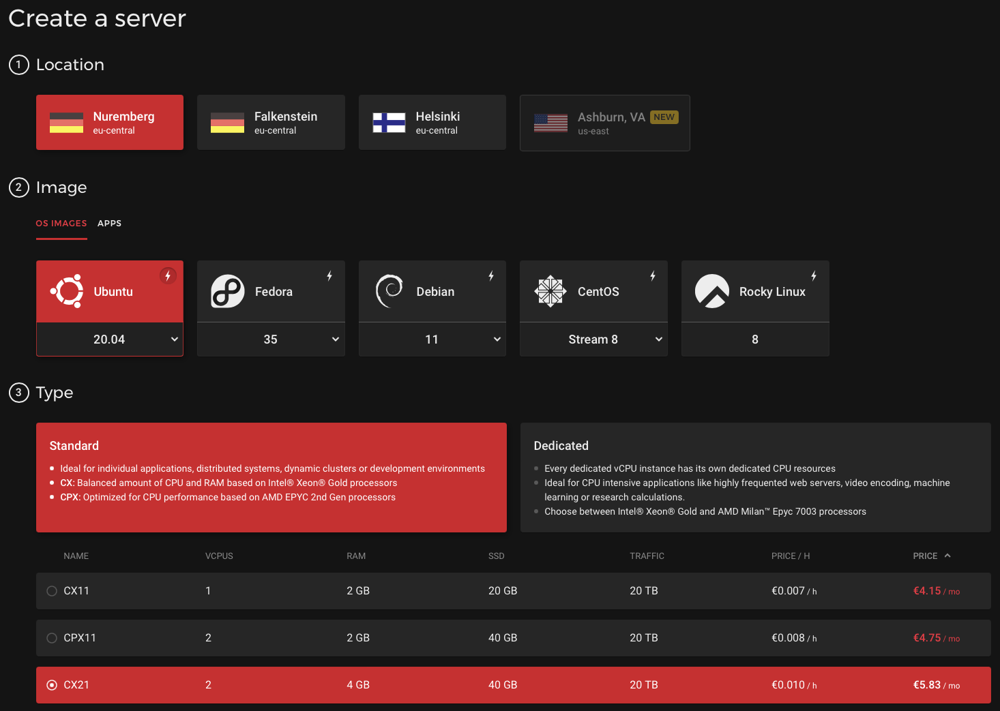

### Create a private Network

We create a network, in my case I take 172.16.0.0/12 here can choose accordingly a Network inside of the private IP address ranges.

* 10.0.0.0/8
* 172.16.0.0/12
* 192.168.0.0/16

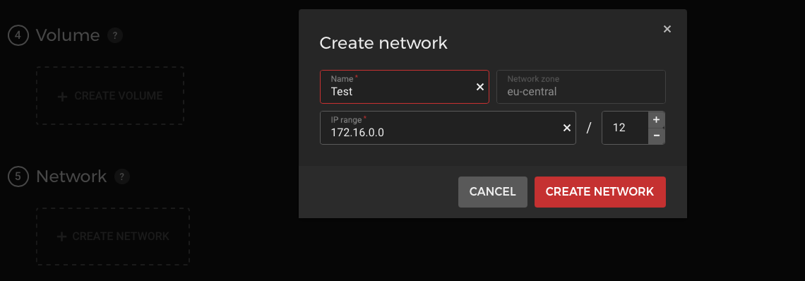


### Additional features

We create a placement group so that our VM's run on different hardware nodes, this improves the availability of the VM's in case we want to switch up our masters or workers at some point or build a larger cluster directly.
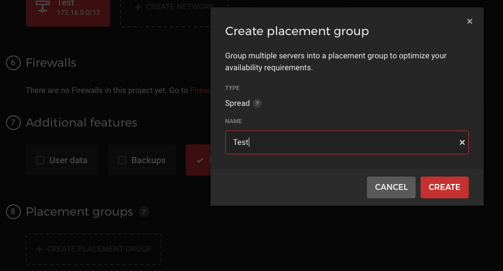

### Create SSH Key

If we don't have an SSH key yet, we can create one for ourselves

```shell
ssh-keygen -t ed25519 -C "your_email@example.com"
```
 
We now store the PublicKey of the SSH key at Hetzner.

```shell
cat ~/.ssh/id_ed25519.pub
```

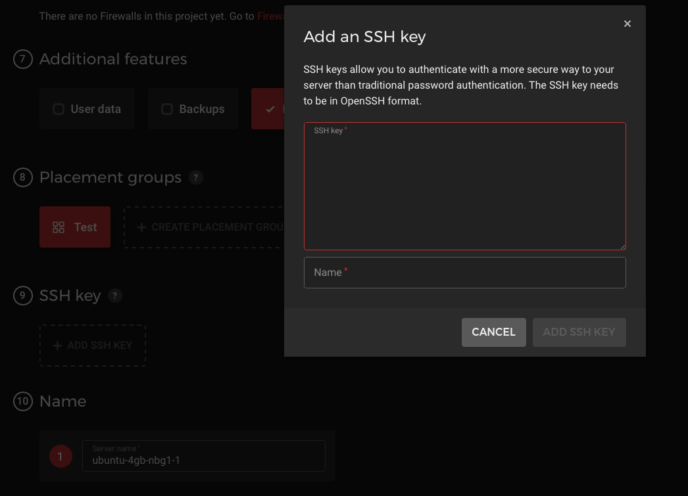

### Create Names

Now we select at "How many servers?" 2 servers and assign names for the two nodes.

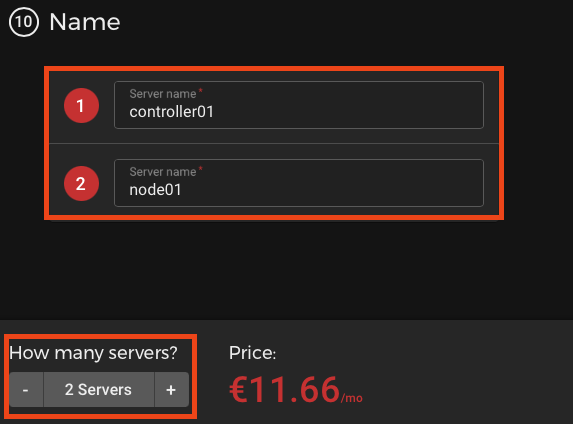

After we have configured everything according to our ideas, we click on "CREATE & BUY NOW".

## Install hcloud on your local Machine
hcloud is a command-line interface for interacting with Hetzner Cloud, so we use the Hetzner documentation to install hcloud on our computer. 

[GitHub - hetznercloud/cli: A command-line interface for Hetzner Cloud](https://github.com/hetznercloud/cli)

```shell
brew install hcloud
```

## Create an API TOKEN
Now that we have installed hcloud on our computer, we need to generate an API token.

To do this, we click on the key "Security" in the bar on the left and then on "API TOKENS" at the top and then on "GENERATE API TOKEN".

We have to set the permissions to "Read & Write" and click on "GENERATE API TOKEN".


After that we copy the API token to the clipboard and configure the hcloud program to use your token:

```shell
hcloud context create $ProjectName
# In Our Case
hcloud context create test
```

## SSH into your Server
Now we can get the public IP of our servers from the Hetzner portal under Servers or we use the hcloud tool.

```shell
hcloud server list
```

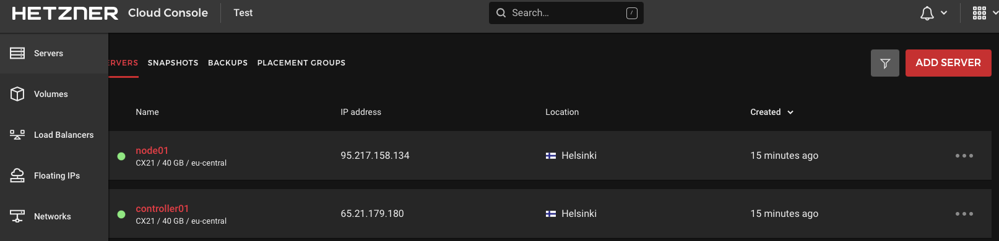

once we get the IP address of the servers, we can log in to the nodes via SSH.

```shell
ssh root@65.21.179.180 -i ~/.ssh/id_ed25519
ssh root@95.217.158.134 -i ~/.ssh/id_ed25519
```

## Update Server components (on all Nodes)
First we update the operating system and install the software we need.
```shell
apt update && apt upgrade -y && apt full-upgrade -y && apt install vim -y
```

## Install Kubernetes
### Install Kubernetes-Tools (on all Nodes)

```shell
wget https://raw.githubusercontent.com/0hlov3/kubernetes-on-hetzner/main/k8s-ubuntu-install/install.sh && \
chmod +x install.sh && \
./install.sh
```

if you get something like the following output, you can simply confirm it with return.

```
Configuration file '/etc/containerd/config.toml'
 ==> File on system created by you or by a script.
 ==> File also in package provided by package maintainer.
   What would you like to do about it ?  Your options are:
    Y or I  : install the package maintainer's version
    N or O  : keep your currently-installed version
      D     : show the differences between the versions
      Z     : start a shell to examine the situation
 The default action is to keep your current version.
*** config.toml (Y/I/N/O/D/Z) [default=N] ?
```

### Initialise your Cluster (on controller01 only!)
To initialise the cluster we need the private and the public IP of our controller01, we can get the IPs with `ip a`  via the Webfrontend.

So if you are on the Server via ssh type `ip a`  to get the IPs.

```shell
# Output shortened
[...]
2: eth0: <BROADCAST,MULTICAST,UP,LOWER_UP> mtu 1500 qdisc fq_codel state UP group default qlen 1000
    inet 65.21.179.180/32 scope global dynamic eth0
[...]
4: ens10: <BROADCAST,MULTICAST,UP,LOWER_UP> mtu 1450 qdisc fq_codel state UP group default qlen 1000
    inet 172.16.0.3/32 brd 172.16.0.3 scope global dynamic 
```

Now take the IP from eth0 (65.21.179.180) and ens10 (172.16.0.3) and create the Command to initialise the CLuster.

```shell
kubeadm init --apiserver-advertise-address $externalIPv4 --apiserver-cert-extra-sans $PrivateIP,$externalIPv4 --control-plane-endpoint $PrivateIP --pod-network-cidr 10.244.0.0/16
```

In our case it looks like:
```shell
kubeadm init --apiserver-advertise-address 65.21.179.180 --apiserver-cert-extra-sans 172.16.0.3,65.21.179.180 --control-plane-endpoint 172.16.0.3 --pod-network-cidr 10.244.0.0/16
```

After we initialised the Cluster  We get some Output.

If you have more than one controller node, you can execute the join command for the controller nodes on the other controllers.

```shell
kubeadm join 172.16.0.3:6443 --token REDACTED \
	--discovery-token-ca-cert-hash sha256:REDACTED \
	--control-plane
```

### Configure the Nodes
Now we can initialise our Nodes, since we habe only one, we will execute the Command only on Node01, the Node will connect to the cluster by executing the join command that was issued to us.

```shell
# Then you can join any number of worker nodes by running the following on each as root:

kubeadm join 172.16.0.3:6443 --token REDACTED \
	--discovery-token-ca-cert-hash sha256:REDACTED
```

### Check the Nodes
Back on Controller01 we can 

```shell
mkdir -p $HOME/.kube
sudo cp -i /etc/kubernetes/admin.conf $HOME/.kube/config
sudo chown $(id -u):$(id -g) $HOME/.kube/config
```

and now Check if all of our Nodes joined the Cluster correctly

```shell
kubectl get nodes -o wide
```

The output should look something like the following.

```shell
# Output
NAME           STATUS   ROLES                  AGE    VERSION   INTERNAL-IP     EXTERNAL-IP       OS-IMAGE             KERNEL-VERSION     CONTAINER-RUNTIME
controller01   NotReady control-plane,master   4d7h   v1.22.5   65.21.179.180                     Ubuntu 20.04.3 LTS   5.4.0-90-generic   docker://20.10.12
node01         NotReady node                   4d7h   v1.22.5   95.217.158.134                    Ubuntu 20.04.3 LTS   5.4.0-90-generic   docker://20.10.12
```

You can see, that our Internal IPs are the external IPs of the Server, that’s the reason we have to install the [hcloud-cloud-controller-manager](_https://github.com/hetznercloud/hcloud-cloud-controller-manager_), the hcloud-cloud-controller-manager configures some things as wee need them. He takes care of routes and that our Kubernetes traffic acts over the internal network.

### Install Flannel
There are tons of [Networking and Network Policy Addons](https://kubernetes.io/docs/concepts/cluster-administration/addons/)) for Kubernetes. In our case we will use Flannel, Flannel is a simple and easy way to configure a layer 3 network fabric designed for Kubernetes.

To install flannel we simply enter the following command on the controller01.

```shell
kubectl apply -f https://raw.githubusercontent.com/coreos/flannel/v0.14.0/Documentation/kube-flannel.yml
```

Patch the flannel deployment to tolerate the uninitialized taint:

```shell
kubectl -n kube-system patch ds kube-flannel-ds --type json -p '[{"op":"add","path":"/spec/template/spec/tolerations/-","value":{"key":"node.cloudprovider.kubernetes.io/uninitialized","value":"true","effect":"NoSchedule"}}]'
```

If we check the Node State again, we should see, that they are in Ready state:
```shell
> kubectl get nodes
NAME           STATUS   ROLES                  AGE     VERSION
controller01   Ready    control-plane,master   4m53s   v1.22.5
node01         Ready    <none>                 4m35s   v1.22.5
```

### Install [hcloud-cloud-controller-manager](https://github.com/hetznercloud/hcloud-cloud-controller-manager)
We will set the cloud controller manager up with network support.

```
NOTE:
When you use the Cloud Controller Manager with networks support, the CCM is in favor of allocating the IPs (& setup the routing) (Docs:  [https://kubernetes.io/docs/concepts/architecture/cloud-controller/#route-controller](https://kubernetes.io/docs/concepts/architecture/cloud-controller/#route-controller) ). The CNI plugin you use needs to support this k8s native functionality (Cilium does it, I don’t know about Calico & WeaveNet), so basically you use the Hetzner Cloud Networks as the underlying networking stack.
When you use the CCM without Networks support it just disables the RouteController part, all other parts work completely the same. Then just the CNI is in charge of making all the networking stack things. Using the CCM with Networks support has the benefit that your node is connected to a private network so the node doesn’t need to encrypt the connections and you have a bit less operational overhead as you don’t need to manage the Network.
```

We have to create a new API-Secret under “Security” -> “API TOKENS” -> Generate API-Token

You can name the token as you want, I’ll name it CloudControllerManager and give “READ & WRITE” permission to it. We need to create a Kubernetes Secret with this Token and the NetworkID.

```shell
hcloud network list
```

```shell
#Output
ID        NAME   IP RANGE        SERVERS
1234567   Test   172.16.0.0/12   2 servers
```

Or you check the Domain when you are in the Network Tab.


```shell
kubectl -n kube-system create secret generic hcloud --from-literal=token=<hcloud API token> --from-literal=network=<hcloud Network_ID_or_Name>
```

```shell
kubectl apply -f https://github.com/hetznercloud/hcloud-cloud-controller-manager/releases/latest/download/ccm-networks.yaml
```

If everything worked as expected, we can check the nodes again. We should notice that the external IPs are now under EXTERNAL-IP and the internal ones under INTERNAL-IP.

```shell
 kubectl get nodes -o wide
```

```
#Output
NAME           STATUS   ROLES                  AGE   VERSION   INTERNAL-IP   EXTERNAL-IP       OS-IMAGE             KERNEL-VERSION     CONTAINER-RUNTIME
controller01   Ready    control-plane,master   29m   v1.22.5   172.16.0.3    116.203.128.46    Ubuntu 20.04.3 LTS   5.4.0-90-generic   docker://20.10.12
node01         Ready    <none>                 28m   v1.22.5   172.16.0.2    116.203.136.110   Ubuntu 20.04.3 LTS   5.4.0-90-generic   docker://20.10.12

```

### Install Container Storage Interface Driver [CSI Driver](https://github.com/hetznercloud/csi-driver)
This is a  [Container Storage Interface](https://github.com/container-storage-interface/spec)  driver for Hetzner Cloud enabling you to use ReadWriteOnce Volumes within Kubernetes. Please note that this driver **requires Kubernetes 1.13 or newer**.

We have to create a new API-Secret under “Security” -> “API TOKENS” -> Generate API-Token

You can name the token as you want, I’ll name it CSIDriver and give “READ & WRITE” permission to it. We need to create a Kubernetes Secret with this Token and the NetworkID.

```shell
kubectl -n kube-system create secret generic hcloud-csi --from-literal=token=<hcloud API token>
```

```
kubectl apply -f https://raw.githubusercontent.com/hetznercloud/csi-driver/v1.6.0/deploy/kubernetes/hcloud-csi.yml
```

To verify everything is working, create a persistent volume claim and a pod which uses that volume:

```shell
kubectl apply -f https://raw.githubusercontent.com/0hlov3/kubernetes-on-hetzner/main/test-deployment/csi-pvc-test.yaml
```

After we crated the deployment, we can check if we got a Volume.

```shell
root@controller01:~# kubectl get pod
NAME         READY   STATUS    RESTARTS   AGE
my-csi-app   1/1     Running   0          39s
```

```shell
root@controller01:~# kubectl get pvc
NAME      STATUS   VOLUME                                     CAPACITY   ACCESS MODES   STORAGECLASS     AGE
csi-pvc   Bound    pvc-965072ab-8c30-49d3-9861-52bd9faae06f   10Gi       RWO            hcloud-volumes   63s
```

If we got a pvc, we can delete our test deployment.

```shell
k delete pod my-csi-app
k delete pvc csi-pvc
```

And check if everything was deleted

```shell
kubectl get pod
kubectl get pvc
kubectl get pv
```

## Install Kubectl and Helm on your local Mashine
If you don't have kubectl installed on your computer yet, you can do so, for this I recommend you to read the Kubernetes documentation for your operating system.

[Install Tools | Kubernetes](https://kubernetes.io/docs/tasks/tools/)

### Install Helm
Helm helps you manage Kubernetes applications — Helm Charts help you define, install, and upgrade even the most complex Kubernetes application.  You can install Helm on your operating system as described in the documentation.

[Helm | Installing Helm](https://helm.sh/docs/intro/install/)


## Additional Steps
### Create a Firewall
Now we can deploy a firewall, for this we have to select Firewalls in the visual navigation and click on "Create Firewall".

We assign a name and set our rules. In this case we work with tags and we are going to create one firewall for both server groups (controller and nodes) later we can also deploy 2 separate firewalls if we want to. We only need to enable the API port 6443 on the master. If you have a fixed IP, you should use the possibility and enter your static IP for SSH(22) and the API(6443) instead of any into the firewall. 


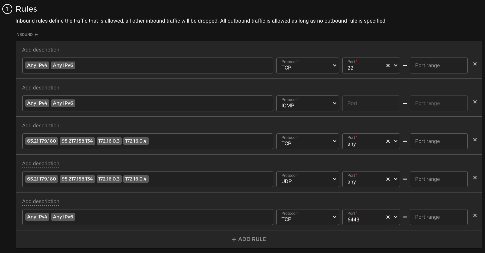
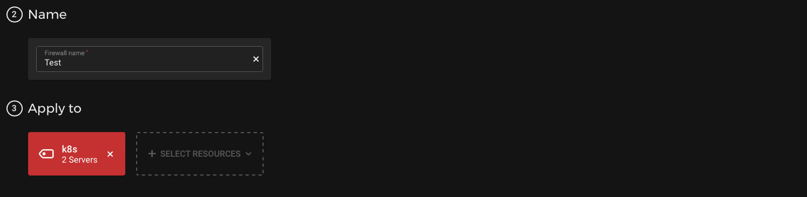

Once we have deployed the firewall, we still need to give our servers the tag/label k8s.

For this you can simply switch to the server tab and assign the labels.


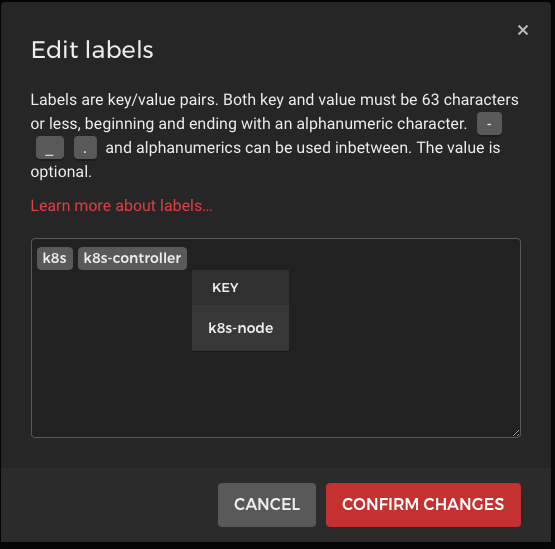


### Copy the KubeConfig
We need the Kubeconfig on our local Machine, if we want to use the Kubectl on our local Machine.

```shell
scp root@116.203.128.46/root/.kube/config ~/.kube/hetzner-config
```

And export the Kubeconfig

```shell
export KUBECONFIG=~/.kube/hetzner-config
```

### Create Users on all Nodes 
```shell
useradd -m -U -s /bin/bash -G sudo,docker testuser
```

Create a Password for the User

```shell
sudo passwd testuser
```

Create a SSH-Folder and Copy the Keys.

```
mkdir /home/testuser/.ssh && \
cp /root/.ssh/authorized_keys /home/testuser/.ssh/ && \
chown -R testuser.testuser /home/testuser/.ssh
```

Logout of the Server and check if you can login with the new User.

```shell
ssh -i ~/.ssh/id_ed25519 testuser@116.203.136.110
```

Check if you can change to root

```shell
sudo -i
```

If SSH is working like a charm, you can start and Configure the SSHD-Server.

### Configure SSH-Server
```shell
sed -i "s/PasswordAuthentication.*/PasswordAuthentication no/" /etc/ssh/sshd_config
sed -i "s/#PermitEmptyPasswords.*/PermitEmptyPasswords no/" /etc/ssh/sshd_config
sed -i "s/X11Forwarding.*/X11Forwarding no/" /etc/ssh/sshd_config
sed -i "s/#ClientAliveInterval.*/ClientAliveInterval 300/" /etc/ssh/sshd_config
sed -i "s/#MaxAuthTries.*/MaxAuthTries 3/" /etc/ssh/sshd_config
sed -i "s/PermitRootLogin.*/PermitRootLogin No/" /etc/ssh/sshd_config

```


## Helpful Links
* [Generating a new SSH key and adding it to the ssh-agent - GitHub Docs](https://docs.github.com/en/authentication/connecting-to-github-with-ssh/generating-a-new-ssh-key-and-adding-it-to-the-ssh-agent)]
* [GitHub - flannel-io/flannel: flannel is a network fabric for containers, designed for Kubernetes](https://github.com/flannel-io/flannel#flannel)
* [GitHub - hetznercloud/hcloud-cloud-controller-manager: Kubernetes cloud-controller-manager for Hetzner Cloud](https://github.com/hetznercloud/hcloud-cloud-controller-manager)
* [GitHub - hetznercloud/csi-driver: Kubernetes Container Storage Interface driver for Hetzner Cloud Volumes](https://github.com/hetznercloud/csi-driver)
* [Welcome - NGINX Ingress Controller](https://kubernetes.github.io/ingress-nginx/)
* [cert-manager](https://cert-manager.io)
* [external-dns/hetzner.md at master · kubernetes-sigs/external-dns · GitHub](https://github.com/kubernetes-sigs/external-dns/blob/master/docs/tutorials/hetzner.md)