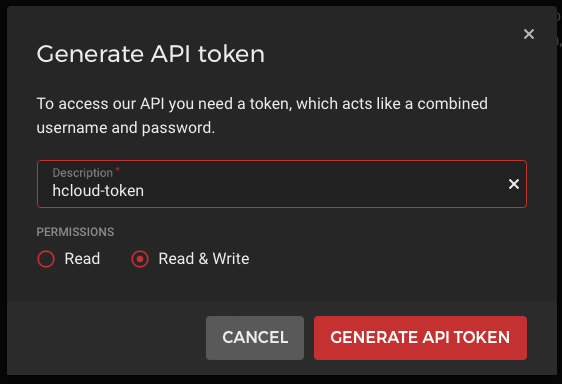

# Install a Kubernetes-Cluster on Hetzner Cloud

## Create Project
First we need an account for the [Hetzner Cloud](https://console.hetzner.cloud/) and have to log in accordingly. 
Once we have logged in, we need to create a project by clicking on "+ NEW PROJECT" and then assigning a name to our project.


## Create 2 Nodes
After we have created the project, we come to the "Servers" overview, since we currently have no servers, there is only the button "Add Server" which we now click to create our nodes.

We will create a 2 node cluster here for development purposes, if we want to run a production Kubernetes cluster we should create 3 controllers and 3 nodes.

Once we have clicked on "ADD SERVER", we choose our location (e.g. Nuremberg) our OS image (e.g. Ubuntu 20.04) our type (e.g. standard CX21).


### Create Network

We create a network, in my case I take 172.16.0.0/12 here can choose accordingly a Network inside of the private IP address ranges.

- 10.0.0.0/8
- 172.16.0.0/12
- 192.168.0.0/16


### Additional features

We create a placement group so that our VM's run on different hardware nodes, this improves the availibility of the VM's in case we want to switch up our masters or workers at some point or build a larger cluster directly.


### Create SSH Key

If we don't have an SSH key yet, we can create one for ourselves

```shell
ssh-keygen -t ed25519 -C "your_email@example.com"
```
 
We now store the PublicKey of the SSH key at Hetzner.

```shell
cat ~/.ssh/id_ed25519.pub
```


### Create Names

Now we select at "How many servers?" 2 servers and assign names for the two nodes.


After we have configured everything according to our ideas, we click on "CREATE & BUY NOW".

## Install hcloud
hcloud is a command-line interface for interacting with Hetzner Cloud, so we use the Hetzner documentation to install hcloud on our computer. 

[GitHub - hetznercloud/cli: A command-line interface for Hetzner Cloud](https://github.com/hetznercloud/cli)

```shell
brew install hcloud
```

## Create an API TOKEN
Now that we have installed hcloud on our computer, we need to generate an API token.

To do this, we click on the key "Security" in the bar on the left and then on "API TOKENS" at the top and then on "GENERATE API TOKEN".

We have to set the permissions to "Read & Write" and click on "GENERATE API TOKEN".



After that we copy the API token to the clipboard and configure the hcloud program to use your token:

```shell
hcloud context create $ProjectName
# In Our Case
hcloud context create test
```

## SSH into your Server
Now we can get the public IP of our servers from the Hetzner portal under Servers or we use the hcloud tool.

```shell
hcloud server list
```


once we get the IP address of the servers, we can log in to the nodes via SSH.

```shell
ssh root@65.21.179.180 -i ~/.ssh/id_ed25519
ssh root@95.217.158.134 -i ~/.ssh/id_ed25519
```

## Update Server components (on all Nodes)
First we update the operating system and install the software we need.
```shell
apt update && apt upgrade -y && apt full-upgrade -y && apt install vim -y
```

## Install Kubernetes
### Install Kubernetes-Tools (on all Nodes)

```shell
wget https://raw.githubusercontent.com/0hlov3/kubernetes-on-hetzner/main/k8s-ubuntu-install/install.sh && \
chmod +x install.sh && \
./install.sh
```

### Initialise your Cluster (on controller01 only!)
To initialise the cluster we need the private and the public IP of our controller01, we can get the IPs with `ip a`  via the Webfrontend.

So if you are on the Server via ssh type `ip a`  to get the IPs.

```shell
# Output shortened
[...]
2: eth0: <BROADCAST,MULTICAST,UP,LOWER_UP> mtu 1500 qdisc fq_codel state UP group default qlen 1000
    inet 65.21.179.180/32 scope global dynamic eth0
[...]
4: ens10: <BROADCAST,MULTICAST,UP,LOWER_UP> mtu 1450 qdisc fq_codel state UP group default qlen 1000
    inet 172.16.0.3/32 brd 172.16.0.3 scope global dynamic 
```

Now take the IP from eth0 (65.21.179.180) and ens10 (172.16.0.3) and create the Command to initialise the CLuster.

```shell
kubeadm init --apiserver-advertise-address $externalIPv4 --apiserver-cert-extra-sans $PrivateIP,$externalIPv4 --control-plane-endpoint $PrivateIP --pod-network-cidr 10.244.0.0/16
```

In our case it looks like:
```shell
kubeadm init --apiserver-advertise-address 65.21.179.180 --apiserver-cert-extra-sans 172.16.0.3,65.21.179.180 --control-plane-endpoint 172.16.0.3 --pod-network-cidr 10.244.0.0/16
```

After we initialised the Cluster  We get some Output.

If you have more than one controller node, you can execute the join command for the controller nodes on the other controllers.

```shell
kubeadm join 172.16.0.3:6443 --token REDACTED \
	--discovery-token-ca-cert-hash sha256:REDACTED \
	--control-plane
```

### Configure the Nodes
Now we can initialise our Nodes, since we habe only one, we will execute the Command only on Node01, the Node will connect to the cluster by executing the join command that was issued to us.

```shell
# Then you can join any number of worker nodes by running the following on each as root:

kubeadm join 172.16.0.3:6443 --token REDACTED \
	--discovery-token-ca-cert-hash sha256:REDACTED
```

### Check the Nodes
Back on Controller01 we can get our KUBECONFIG with the following commands.

```shell
mkdir -p $HOME/.kube
sudo cp -i /etc/kubernetes/admin.conf $HOME/.kube/config
sudo chown $(id -u):$(id -g) $HOME/.kube/config
```

and now Check if all of our Nodes joined the Cluster coreectly

```shell
~# kubectl get nodes -o wide
NAME           STATUS   ROLES                  AGE    VERSION   INTERNAL-IP     EXTERNAL-IP       OS-IMAGE             KERNEL-VERSION     CONTAINER-RUNTIME
controller01   NotReady control-plane,master   4d7h   v1.22.5   65.21.179.180                     Ubuntu 20.04.3 LTS   5.4.0-90-generic   docker://20.10.12
node01         NotReady node                   4d7h   v1.22.5   95.217.158.134                    Ubuntu 20.04.3 LTS   5.4.0-90-generic   docker://20.10.12
```

## Install Hetzner hcloud-cloud-controller-manager
[hcloud-cloud-controller-manager](https://github.com/hetznercloud/hcloud-cloud-controller-manager)

## Install Hetzner csi-driver
[csi-driver](https://github.com/hetznercloud/csi-driver)

## Install ingress-nginx
[ingress-nginx](./ingress-nginx/README.md)

## Install cert-manager
[cert-manager](./cert-manager/README.md)


## Create Users on all Nodes TO BE FINISHED
```shell
useradd -m -U -s /bin/bash -G sudo,docker testuser
```

```shell
sudo passwd testuser
```

Logout of the Server and check if you can login with the new User.

```shell
ssh-copy-id testuser@$externalIPodServer
```

```shell
ssh testuser@$externalIPodServer
```

Check of your PublicKey is in the User Direcoty

```shell
ssh testuser@65.21.179.180
```

Check if you can change to root

```shell
sudo -i
```

If SSH is working like a charm, you can start and Configure the SSHD-Server.

## Configure SSH-Server  TO BE FINISHED
Perform this step only if you are sure that the newly created user can really log in with key authentication.
```shell
sed -i "s/PasswordAuthentication.*/PasswordAuthentication no/" /etc/ssh/sshd_config
sed -i "s/#PermitEmptyPasswords.*/PermitEmptyPasswords no/" /etc/ssh/sshd_config
sed -i "s/X11Forwarding.*/X11Forwarding no/" /etc/ssh/sshd_config
sed -i "s/#ClientAliveInterval.*/ClientAliveInterval 300/" /etc/ssh/sshd_config
sed -i "s/#MaxAuthTries.*/MaxAuthTries 3/" /etc/ssh/sshd_config
sed -i "s/#prohibit-password.*/prohibit-password no/" /etc/ssh/sshd_config
```

## Helpful Links
- [Generating a new SSH key and adding it to the ssh-agent - GitHub Docs](https://docs.github.com/en/authentication/connecting-to-github-with-ssh/generating-a-new-ssh-key-and-adding-it-to-the-ssh-agent)]
- 

## Don‘t trust me
The author does not assume liability for errors contained in or for damages arising from the use of the Information. 